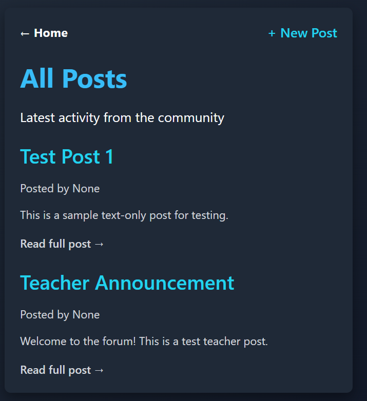

# Web Pages Design.md

This document defines the planned web pages for AnonReview, as well as rendering and testing requirements.

# 1) Login Page

## Title

Login

## Page Description

This page allows users who are not currently in a session to log into their AnonReview account. If the user does not have an account, they can access the registration page from this page.

## Page Route

**Login** → `/login`

**Mockup for Login**
```
+------------------------------------------------------+
| Welcome to AnonReview!                               |                 |                                                      |
|------------------------------------------------------|
| Login                                                |
|                                                      |
| Username: [       ]                                  |
| Password: [       ]                                  |
| [Submit]                                             |
|                                                      |
| Don't have an account? Register!                     |
+------------------------------------------------------+
```

## Route Parameters:

None

## Query Parameters:

URL query parameter `?redirect=/path` if user tries to access protected pages outside a session (user redirected to login page)

## Link Destinations for Page

**Submit success** → `/dashboard` (redirect)
**Register** → `/register`
**Submit failure** → `/login` (show Login page with error message)

## Data Required to Render Page

1. UI state: username, password, validation errors
2. API: To be added
3. Auth State Storage: To be added

## Tests for Verifying Rendering of the Page

1. **Template elements rendered**
   - Page title is displayed
   - Page header is displayed
   - Username and Password entry fields are visible, user can enter data
   - Submit button is visible and clickable
   - Link to Registration page is visible and clickable
   - Error messages are visible if user credentials are invalid (credentials do not meet validation parameters, no matching account exists)
     

2.   **Redirect Behaviour**
   - If user credentials are valid, redirect to Dashboard page
   - If user is in session, redirect to Dashboard page
   
   
# 2) Registration Page

## Title

Register

## Page Description

This page allows users to create an AnonReview account. It also allows users to navigate to the Login page.

## Page Route

**Register** → `/register`

**Mockup for Registration**
```
+------------------------------------------------------+
| Welcome to AnonReview!                               |                 |                                                      |
|------------------------------------------------------|
| Register                                             |
|                                                      |
| Username: [       ]                                  |
| Password: [       ]                                  |
| Email:    [       ]                                  |
| Role:     [Drop-Down Menu (Student, Teacher, Admin   |
|           Moderator)]                                |
|                                                      |
| [Register]                                           |
|                                                      |
| Already have an account? Log in!                     |
+------------------------------------------------------+
```

## Route Parameters:

None

## Query Parameters:
None

## Link Destinations for Page

**Submit success** → `/login` (redirect)
**Submit failure** → `/register` (show Register page with error message)

## Data Required to Render Page

1. UI state: username, password, email, role, validation errors
2. API: To be added
3. Auth State Storage: To be added

## Tests for Verifying Rendering of the Page

1. **Template elements rendered**
   - Page title is displayed
   - Page header is displayed
   - Username, Password, Email, Role entry fields are visible, user can enter data
   - Role drop-down menu is visible, menu items are clickable
   - Register button is visible and clickable
   - Link to Login page is visible and clickable
   - Error messages are visible if attempted user credentials are   invalid (attempted credentials do not meet validation parameters, account with attempted username and/or email already exists)


2.   **Redirect Behaviour**
   - If user credentials are valid, redirect to Login page
   - If user is in session, redirect to Dashboard page

# 3) Dashboard Page

## Page Title 
Dashboard

## Page Description
Home page when logged in. Options to view post, interact with post, or add post.

## Page Route

**Dashboard** → `/dashboard`

**Mockup for Dashboard**


## Route Parameters:
Login → Dashboard
Logging in is required to access the dashboard.

## Query Parameters:
None
## Link Destinations for Page
/dashboard

## Data Required to Render Page
* Comments
* Files
* User created posts


## Tests for Verifying Rendering of the Page
* Render pages and posts in the database.
* Render comments in the database.


# 4) Create Post Page

## Page Title


## Page Description
Shows all posts that have been made by users, and include the ability to add posts.

## Page Route
/dashboard

**Mockup for Create Post**


## Route Parameters:


## Query Parameters:


## Link Destinations for Page


## Data Required to Render Page


## Tests for Verifying Rendering of the Page


# 5) View Single Posts Page

## Page Title 


## Page Description


## Page Route


**Mockup for View All Posts**


## Route Parameters:


## Query Parameters:


## Link Destinations for Page


## Data Required to Render Page


## Tests for Verifying Rendering of the Page


